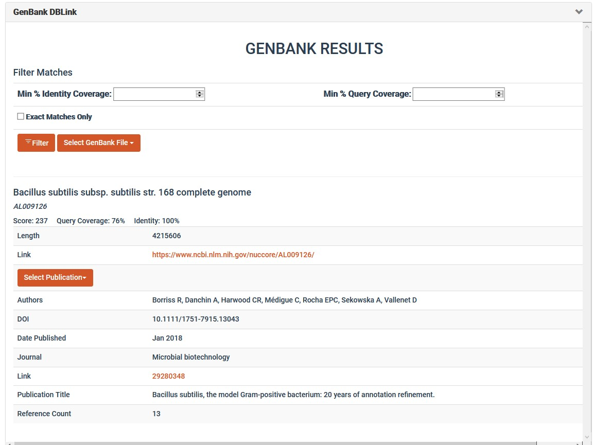

# Plugin-Visual-GenBankLink

### A plugin to get related GenBank files to SynBioHub Components. 

### Please view the [wiki](https://github.com/helloSeen/Plugin-Visual-GenbankLink/wiki) for detailed information on how the plugin works.

## Components
This plugin has three main components:
1. **The Database Servers:** These are the servers (we used many AWS instances) that will store partitions of the GenBank NT Database for querying. **Please note that these servers require significant computational power for the plugin to run quickly**
2. **The Communication Server:** This is the server (we used an AWS instance) that will receive request from the plugin and will return results to the plugin's HTML page
3. **The Plugin Server:** This is the server that will run on the host machine, whose address will be entered into the plugins page on SynBioHub

## Setup Instructions (Docker)

## Setup Instructions (Standalone via Python)

### Database Server
For each Database Server:
1. Clone this repo
2. Note the public IP Address of the machine
3. Run `pip install -r requirements.txt`
4. Run `python responder.py`

### Communication Server
For the Communication Server:
1. Clone this repo
2. Note the public IP Adddress of the machine
3. Enter the `CommNode/` directory
4. Run `pip install -r requirements.txt`
5. Enter the public IP addresses of each Database Server in the file `DBIPs.txt`
6. Set the environment variables `PLUGIN_EMAIL` and `ENTREZ_API_KEY` as your email and NIH Entrez Api Key. These are used to query the Entrez Databases for results
7. Run `python app.py`

### Plugin Server
For the Plugin Server:
1. Clone this repo
2. Run `pip install -r requirements.txt`
3. Enter the public IP address of the Communication Server in the file `CommIP.txt`
4. Run `python app.py`
5. In the SynBioHub admin plugin page, enter the IP Address of this server with the appropriate port (default 5050)
